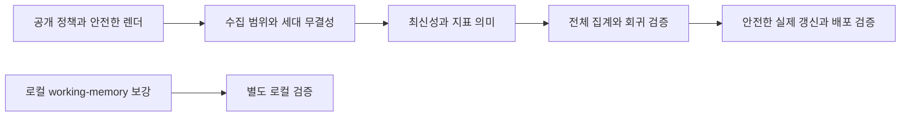

# Activity Atlas 적대적 리뷰와 수정·보강 계획

검토일: 2026-10-03, Asia/Seoul. 대상: `/home/juke/git/activity-atlas`, `main`, `c024eed53626877bf60dbbc6f2c45efb5ba9205b`. 장르: 기술·제품 평가 보고서. 원본 코드 수정과 배포는 이번 작업 범위에 포함하지 않는다.

## 1. 판정과 평가 기준

**판정: 수정 필요. 공개 운영의 안전성과 랩 의사결정 도구로서의 해석은 우선 보강해야 한다.** 8개 화면의 기본 동작은 확인했지만, 현재 구현은 공개 경계·수집 범위·지표 의미를 충분히 보장하지 않는다. 새 시각화 추가보다 F01–F09의 결함을 먼저 처리한다.

점수는 부여하지 않았다. 사용 효과를 측정한 독립 평가가 없으므로 코드·데이터·동작 증거로 입증할 수 있는 준비 상태를 판단했다.

| 평가 축 | 현재 평가 | 근거와 실무 의미 |
|---|---|---|
| 개인 GitHub 활동 회고 | 제한적으로 사용 가능 | Overview·Latent·Network·Pulse가 표시된다. 기간·PI 범위·커밋 스타일 차이를 전제해야 한다. |
| 공개 정보 보호 | 공개 확대 전 수정 필수 | private 저장소 이름, 파생 텍스트 우회, HTML 실행 경로가 남아 있다. |
| 수집·분석 무결성 | 보장 부족 | `--full`의 범위 혼합, SHA 전역 중복 제거, 행 수만 비교하는 파생물 검사. |
| 연구실 관리·자원배분 판단 | 해석 재검토 필요 | PI 데이터로 기여자 수·승계 위험을 계산하고, 커밋 비중을 실제 투입으로 표현한다. |
| 지속 갱신 | 자동 재배포만 확인 | 수집은 로컬 수동. CI 성공은 데이터 최신성을 입증하지 않는다. |
| 화면 기본 동작 | 확인된 범위 통과 | 공개 8페이지 HTTP 200, 페이지 JavaScript 예외 0. 시각적 Overview도 확인. |
| 회귀 검증·문서 계약 | 보강 필요 | 실행 가능한 회귀 테스트가 없고 현재 JSON 43행이 명시된 스키마와 불일치. |
| 로컬 working-memory 동반 기능 | 실험 단계 | 미추적 코드에 snooze/cooldown 우회가 재현됨. 실제 알림 전달·효과는 미검증. |

## 2. 증거 범위와 현재 상태

검토 자료는 최신 코드, JSON 집계, 7월 인계문서, 원격 SHA·Actions 상태, 공개 사이트의 실제 Chromium 동작이다. 합성 데이터 실험은 임시 디렉터리에서 실제 모듈을 호출했다. 실제 원본·학생 이름·커밋 메시지를 보고서나 증거 파일에 복사하지 않았다.

- 로컬·원격 `main` SHA가 일치한다. [최근 확인한 CI](https://github.com/snuconnectome/activity-atlas/actions/runs/36451389960)는 성공했으며, 시작 시각은 2026-09-29 01:29:23 KST이다.
- 공개 데이터: 2,226커밋, 134개 활동 저장소. 최종 커밋 시각은 `2026-07-29T15:43:24Z`, 즉 **7월 30일 00:43:24 KST**. 대시보드 KPI는 문자열의 UTC 날짜인 7월 29일을 표시한다.
- 현재 비공개 원본 2,226행, 모델의 `source_n_commits` 2,226. 과거 내부 산출물은 6,926행으로 범위가 다르다.
- 공개 `commits_slim.json`과 `lifecycle.json`의 응답 바이트는 로컬 파일과 같다. 원본 경로와 공개 `people.json`은 각각 HTTP 404다.
- 공개 화면 실측: KPI 4개, UMAP 점 2,183개·토픽 12개, Cytoscape canvas 3개, Pulse 40주, 내부 사람 카드 0개. Drift의 붙여넣기 블록도 표시됨.
- 이 검사는 알려진 결함을 겨냥한 검사다. 화면 전체의 접근성·모든 상호작용·토픽의 과학적 타당성·학생의 동의 상태를 인증한 것이 아니다.

증거 파일: `adversarial-evidence.json`(집계·13개 합성 프로브·소스 해시), `browser-evidence.json`(8페이지·공개 리소스·합성 HTML 실행). 재현 도구: `audit_activity_atlas.py`, `browser_audit.py`. 브라우저 기록의 Drift `tbody` 초기 선택자는 화면에 존재하지 않는 선택자였으며, 실제 존재하는 `pre`의 표시를 추가 검증했다.

## 3. 주장 대조와 적대적 발견

우선순위: **P0** 현재 공개 범위의 결함, **P1** 공개 확대·관리 판단·실제 갱신 전에 수정할 결함, **P2** 기능 신뢰성과 유지보수 보강. 각 항목의 확신도는 관찰한 결함 자체에 대한 것이며 실제 피해 발생에 대한 판단이 아니다.

### F01 · P0 · private 저장소 식별자가 여러 공개 경로에 남아 있다

**근거:** `scripts/join.py:57`의 `KEEP_FIELDS`에 `repo`가 남고 `build_lifecycle()`(`:204`)은 전체 inventory 이름을 내보낸다. 공개 커밋 데이터에 private 활동 저장소 이름 **104개**, 공개 Lifecycle에 private inventory 이름 **277개**, 현재 Git 추적 taxonomy에 private 이름 **115개**가 존재한다. 세 숫자는 서로 다른 집합이므로 더해서 유출 개수로 쓰지 않는다. private 여부는 로컬 수집 시점의 기록이며 오늘의 GitHub 권한 상태를 전수 재조회한 값은 아니다.

**문제:** `_quarto.yml:8`의 공개 데이터 allowlist는 경로만 제한한다. 저자 동의는 private 저장소 내용·프로젝트 이름의 공개 권한과 동일하지 않다. Pages의 `repo`만 가려도 현재 공개 Git taxonomy와 과거 히스토리에 이름이 남는다.

**수정:** 저장소 공개 정책을 `full / aggregate_only / exclude`로 정의한다. private·unknown·검토 전 저장소는 기본적으로 `aggregate_only` 또는 제외하고, 공개 예외는 명시적인 승인 근거를 기록한다. 비공개 taxonomy 원본은 로컬로 옮기고 공개에는 승인된 분류만 둔다. commit·lifecycle·drift·coverage·pulse·topic label·링크·검색 색인까지 같은 정책을 적용한다. 단순 해시 치환은 작은 그룹·지속 식별자를 통한 재식별 위험을 없애지 못하므로 공개 그룹 집계를 우선한다.

**완료 기준:** 비공개 fixture의 식별자·SHA·주제 문자열이 공개 JSON, 렌더 결과, 검색 색인, 현재 공개 추적 파일 어디에도 없고, 허용된 집계 합계는 유지된다. **기존 히스토리 처리 완료와 현재 버전 개선 완료를 별개로 보고한다.** 확신도: 높음.

### F02 · P0 · 토픽 검열이 파생 텍스트 전체에 적용되지 않는다

**근거:** `mask_topic_labels()`(`scripts/join.py:341`)는 한 비동의자가 60%를 넘거나 작은 토픽에 비동의자가 있는 경우만 가린다. 비동의자 A·B가 5개씩 쓴 10행 토픽에서는 **0개가 마스킹**된다. `weekly_pulse.py:133`는 원래 토픽 라벨로 문장을 만들고 `join.py:593`은 pulse를 그대로 복사한다. 별도 fixture에서 topics는 `topic-0`으로 마스킹됐는데 pulse에는 원래 문자열이 유지됐다.

**문제:** “비동의자 우세 토픽 라벨을 가렸다”는 좁은 보장은 확인되지만, “비동의자의 글이 공개되지 않는다”는 넓은 보장은 성립하지 않는다. 현재 학생 텍스트 피해가 실제로 발생했다고 단정하지 않는다. 보호 규칙이 향후 다중 저자 수집에서 실패한다는 재현이다.

**수정:** 공개 텍스트는 허용된 저자·저장소 출처만으로 별도로 산출하거나 중립 라벨로 대체한다. Pulse는 `topic_id`·수치·이벤트 종류로 구조화하고 공개 정책 적용 후 승인된 라벨을 사용한다. 단순히 60%를 다른 수치로 낮추는 변경은 해결이 아니다.

**완료 기준:** 50/50 비동의·동의/비동의 혼합·동의 철회·작은 토픽·누락 동의의 fixture 모두에서 금지 문자열이 모든 공개 출력에 0건. 허용된 저자의 일반 텍스트는 필요한 화면에서 유지된다. 확신도: 높음.

### F03 · P1 · 데이터 문자열이 실제 화면에서 JavaScript로 실행된다

**근거:** `pulse.qmd:50`의 `innerHTML`, `latent.qmd:71`의 라벨·`:114`의 subject HTML 삽입. 브라우저에서 Pulse JSON 응답만 합성 fixture로 가로챘을 때 ``가 실행되어 `window.__aaAuditInjected`가 true였다. 공격 코드는 브라우저 임시 컨텍스트에만 존재했고 저장·배포하지 않았다.

**문제:** GitHub 메시지·분석 라벨을 읽기 전용 데이터로 취급해도 HTML 문맥에서는 코드가 된다. 실제 침해·계정 정보 탈취는 확인하지 않았다.

**수정:** 라벨·제목·repo·문장에 `textContent`와 DOM 생성 API를 사용한다. 코드 표시도 문자열 치환 대신 `<code>` 노드로 만든다. 링크는 허용된 GitHub 경로로 생성하며 색 값도 형식 검증한다. CSP는 추가 방어로 검토하되 안전한 DOM 처리의 대체로 쓰지 않는다.

**완료 기준:** Pulse·Latent·People·Drift·Lifecycle에 태그·따옴표 fixture를 넣어도 이벤트 핸들러 실행 0건, 한국어·영문 텍스트와 정상 링크는 표시됨. 확신도: 높음.

### F04 · P1 · `--full`이 범위와 시간창을 초기화하지 않는다

**근거:** `fetch_commits.py:215`는 cursor만 비우고 `:263`부터 `load_existing()`을 다시 합친다. 기존 학생 1행(500일 전)+새 PI 1행 fixture에서 **PI `--full`의 결과가 2행**이며 학생·기간 밖 행이 유지됐다. 동일 원본·cursor를 PI와 전체 저자가 공유한다.

**문제:** 7월 인계문의 “전체 수집 후 `--all-authors`를 빼고 반복해 공개본으로 돌아오기” 지침을 그대로 따라도 PI 전용 스냅샷을 보장하지 못한다. PI→전체 저자 전환의 증분 cursor도 이미 지나간 학생 이력을 놓칠 수 있다.

**수정:** author scope·기간·수집 설정별 원본과 cursor를 분리한다. `--full`은 해당 scope의 새 스냅샷을 구성하며 증분 병합 때도 scope와 기간을 재검증한다. 일부 repo 실패는 completeness manifest에 기록하고 불완전 스냅샷은 새 정상본으로 승격하지 않는다. overwrite 대신 임시 세대에 수집 후 성공 시 원자적으로 전환한다.

**완료 기준:** PI↔전체 저자 양방향 전환, 365일 경계, repo 실패, 중단·재시작 fixture에서 scope 밖 행 0, 이전 정상본 보존, 누락 원인 표시. 확신도: 높음.

### F05 · P1 · SHA만으로 dedup해 저장소별 활동이 사라진다

**근거:** `fetch_commits.py:264`와 `:290`는 `by_sha`를 사용한다. 동일 SHA가 두 저장소에 있는 fixture에서 **저장소 연관 2개 중 1개만** 남는다. `shaToTopic`, `commitBySha`도 SHA 단독 식별자다.

**수정:** 저장소 이벤트 ID는 `(org, repo, sha)`로 정의한다. 텍스트 임베딩 캐시는 동일 메시지·SHA를 재사용할 수 있지만 repo 연관은 분리해 보존한다. canonical author 병합도 이벤트 식별과 구분한다.

**완료 기준:** fork/mirror fixture의 두 저장소가 모두 집계·hover·taxonomy에 남고, 같은 repo의 같은 SHA만 중복 제거된다. 실제 현 데이터의 손실량은 미측정. 확신도: 높음.

### F06 · P1 · 파생물의 “지문”은 행 수이고, 누락 파일은 정상 종료한다

**근거:** `topic_model.py:366` 기록과 `join.py:536` 검사는 `source_n_commits`만 사용한다. 행 수 1인 새 원본+이전 SHA 임베딩 fixture가 종료 0으로 공개된다. `join.py:196`은 누락 파일을 건너뛰고 `:593`은 기존 파일을 지우지 않아 **이전 topics가 새 commit 데이터와 함께 유지**되는 fixture도 종료 0이다. embeddings·pulse·inventory에 동일 세대 검사가 없다.

**수정:** 정렬된 이벤트 ID·저자·입력 텍스트·scope·기간·정책/분류 버전·모델 설정으로 입력 fingerprint를 만든다. 공통 generation ID를 모든 산출물에 기록하고 필수 파일, 참조 무결성, 범위, completeness를 검사한 뒤 임시 디렉터리에서 전체 세대를 교체한다. 공개 hash에 비공개 원문을 직접 노출하는 방식은 피한다.

**완료 기준:** 동일 행 수 다른 내용, 잘못된 SHA, 누락 pulse/embedding/inventory, 옛 metadata, 쓰기 중단을 모두 거부하고 현재 정상 출력의 해시가 바뀌지 않는다. `--report`도 검증 범위를 명시한다. 확신도: 높음.

### F07 · P1 · 활동량을 실제 투입·전체 승계 위험으로 확대 해석한다

**근거:** `index.qmd:265–279`는 커밋 비중을 “실제 투입”으로 표시한다. `join.py:165–171`은 repo별 person-week를 시간과 대응하고 “ceiling of 1”이라고 설명하지만 한 사람이 같은 주에 2개 repo를 만진 fixture는 **2**다. 공개 Lifecycle의 기여자 최대치는 **1**, 승계 플래그는 **16개**다. PI-only 입력으로 전체 기여자 수를 만들기 때문이다. 과거 내부 artifact에서는 이 16개 중 **3개**에 기여자 2명 이상이 있다. 과거 내부본도 최신 사실의 정답은 아니며, 두 scope가 다른 결과를 만든다는 증거다.

**수정:** Overview를 “계획 배분과 GitHub 활동 구성”으로 표현하고 비용·시간·생산성·성과라는 해석을 제거한다. person-repo-week는 활동 폭 지표로 정확히 명명한다. 시간 배분을 측정하려면 별도 시간 자료와 타당화가 필요하다. PI-only에서는 전체 소유권·승계 위험을 산출하지 않거나 “관측한 PI 활동”만 표시한다. 전체 저자 데이터에서도 ownership·후계자·중요도 정보와 사람이 확인한 후보를 구분한다.

**완료 기준:** 모든 화면에 scope·분모·단위·관측기간이 표시된다. 같은 작업을 여러 커밋/여러 repo로 쪼갠 반례에서 지표 해석의 한계가 드러난다. PI-only로 전체 기여자/승계 결론을 내리지 않는다. 확신도: 높음.

### F08 · P1 · 재배포 성공을 최신 활동으로 읽기 쉽다

**근거:** `.github/workflows/build.yml:3–18,79`는 Python 수집 없이 Quarto만 실행한다. 현재 공개 데이터는 7월 30일 KST에서 끝나고 9월 CI는 같은 SHA를 다시 배포했다. 수집 시도일·관측 cutoff·scope·completeness manifest가 화면에 없다. 최신 commit 날짜만으로 “실제 활동 없음”과 “수집 정체”를 구분할 수 없다.

**수정:** manifest에 마지막 성공 수집 시각·관측 종료일·관측기간·scope·repo 성공/실패 수·generation ID를 기록한다. 데이터 나이는 마지막 commit 대신 성공 수집/관측 cutoff 기준으로 표시한다. 새 데이터 없음과 수집 실패를 다르게 표시한다. 기본 제안은 로컬 수집→검증→수동 승인 공개의 짧은 흐름이며, 수집 자동화는 별도 운영 선택이다. 넓은 권한 토큰을 CI에 넣지 않는다.

**완료 기준:** 최신 성공 수집에 0커밋, 30일 정체, 일부 실패 fixture가 각각 다른 상태로 표시된다. 실제 refresh는 F04–F06 통과 후 수행한다. 확신도: 높음.

### F09 · P1 · PI commit 시각은 학생 작업을 본 시점·접촉 시점이 아니다

**근거:** `build_people()`(`join.py:274–296`)는 학생이 손댄 repo에 PI가 가장 최근 commit한 시각을 사용한다. 학생이 처음 작업하기 **140일 전**의 PI commit도 “마지막 접촉 140일 전”으로 기록되는 fixture가 재현된다. `people.qmd:99`의 문구는 “마지막 접촉”이다. README의 “how long since the PI last looked”도 실제 관측값보다 강하다.

**수정:** 기본 카드에는 “공유 repo에 남은 PI commit 기록”이라는 관측 사실만 표시한다. 실제 검토·면담 시점이 필요하면 사람이 기록하는 `reviewed_at/contact_at`을 별도로 둔다. 무기록은 불명으로 유지하고 우선순위 기준을 명시한다. GitHub 침묵으로 학생의 상태·성과를 추론하지 않는 원칙은 유지한다.

**완료 기준:** 학생 참여 이전 PI commit이 실제 접촉으로 표시되지 않고, 실제 검토 기록 없이 “본 지 N일”을 생성하지 않는다. 화면 정렬·문구·질문 모두 같은 의미를 사용한다. 확신도: 높음.

### F10 · P2 · 빈 주·0일·연말 경계가 시간 표현을 왜곡한다

**근거:** `weekly_pulse.py:90–96`은 활동 주만 정렬해 직전 활동 주를 “전주”로 부른다. 20주 간격 fixture에서 21주 시간창이 **2행**이 됐다. `join.py:302`의 최근8은 최근 8개 활동 주이며 무활동 주를 생략한다. `:319`의 `days or 9999`는 **0일→9999**로 바꿔 오늘 접촉한 카드를 30일 카드 앞에 둔다. `index.qmd:108`의 `%Y-W%V`는 2025-12-29를 **2025-W01**로 만들지만 ISO 연도는 **2026-W01**이다. D3 실행에서도 확인했다.

**수정:** 성공적으로 관측한 연속 ISO 주를 생성하고 무활동 0과 관측 누락 unknown을 구분한다. 최근8은 기준 종료일의 연속 8주로 맞춘다. `None`은 별도 정책으로 정렬하며 0을 유효값으로 보존한다. 캘린더에 `%G-W%V` 또는 ISO 월요일 날짜를 사용한다. UTC/KST 표시 기준도 일관되게 문서화한다.

**완료 기준:** 20주 gap, ISO 52/53주·연말, 0/None/30일, 시간대 경계 fixture에서 순서·분모·표시가 맞는다. 확신도: 높음.

### F11 · P2 · 산점도 샘플이 Network의 통계 입력으로 사용된다

**근거:** `join.py:524–528`은 embeddings를 줄인 뒤 샘플에 포함된 행만 SHA를 남긴다(`:557`). Network의 topic vector(`network.qmd:72`)와 Sankey(`:231`)는 이 SHA로 topic을 찾는다. 과거 lab 모델은 6,466행인데 공개용 구조와 같은 내부 projection의 embeddings/SHA는 **2,499행**이다. 따라서 네트워크의 주제 통계는 원본 전체를 집계한 값이 아니다. 현재 PI 공개본은 2,183개 전체 모델 포인트가 유지되어 다운샘플에 따른 영향은 주로 lab 규모에서 발생한다.

**수정:** 전체 모델 결과에서 domain/repo/org × topic 집계를 먼저 생성하고 Network가 이를 읽게 한다. 좌표 샘플과 tooltip lookup은 Latent 전용 파일로 분리한다. topic 크기·outlier·전처리 제외·샘플 크기를 구분해 표시한다. UMAP 거리·배치와 cosine 연결을 협업·과학적 관계로 확대 해석하지 않는다.

**완료 기준:** 산점도 예산 500/2,500/전체로 바꿔도 Network 집계와 연결 가중치는 같고, 예산에 따라 산점도 점 수만 변한다. 현재 연결 왜곡의 정확한 크기는 미측정. 확신도: 높음(입력 경로), 중간(실제 왜곡 크기).

### F12 · P2 · 명시된 스키마·문서·검증 기준이 실제와 어긋난다

**근거:** `data/schema.json:22`는 sha·subject를 필수로 요구하지만 현재 공개본 **43행이 실패**한다. 마스킹 시 `top_words=[]`도 선언된 최소 길이 3과 충돌한다. 존재하지 않는 `redact.py`, 초기 저장 경로와 페이지 수, 75개 UMAP·6토픽 DOM 기준이 문서에 남아 있다. CI는 문자열 guard와 render만 수행하고 브라우저·스키마·합성 경계 테스트를 실행하지 않는다.

**수정:** actual output의 구분(전체 집계 행/산점도 lookup/마스킹 토픽)을 명시적인 버전 계약으로 만든다. 필드를 무조건 optional로 바꾸는 대신 각 consumer의 필요 필드를 검증한다. 공개 데이터에 금지 필드가 추가되면 실패하도록 허용목록 검사한다. CLAUDE·README·about·HANDOFF 상충 지침을 정리하고 repo 로컬 fixture 테스트를 CI에 추가한다. 브라우저 기대치는 실제 JSON을 기준으로 산출한다.

**완료 기준:** 허용된 모든 프로파일 산출물이 스키마를 통과하고 금지 필드·잘못된 참조는 거부된다. 새 clone에서도 private 토큰 없이 fixture 테스트·공개 렌더·브라우저 검증을 재현한다. 핵심 차트에는 텍스트 요약, 키보드로 읽을 수 있는 대안과 좁은 화면 검증을 보강한다. 확신도: 높음.

### F13 · P2 · 미추적 working-memory의 snooze·cooldown은 알림 금지가 아니다

**근거:** 미추적 `scripts/workmem.py:354,415`는 미래 snooze에 최대 −35, 최근 알림에 −25점만 적용한다. 합성 overdue 항목의 점수는 **snooze 중 75**, **알림 1분 후 85**로 기본 임계값 55를 넘는다. 점수 함수만 호출했으며 실제 알림은 보내지 않았다. `cmd_notify()`(`:585`)는 ready이면 렌더에서 먼저 nudged를 기록하며 desktop subprocess 전달 성공은 확인하지 않는다.

**수정:** 사용자 snooze·not-before·cooldown을 notification eligibility의 명시적 gate로 분리한다. 준비 점수와 발송 허용 여부를 구분하고 시간·캘린더 미상은 미상으로 표현한다. 알림 시도·성공·실패의 상태를 분리한다. 이 동반 기능은 공개 대시보드 개선과 독립적으로 다룬다.

**완료 기준:** 최대 점수에서도 snooze·cooldown 동안 delivery 호출 0회. 실제 전달 실패가 성공 기록으로 남지 않는다. 동시에 실행한 알림이 중복되지 않는지 fixture로 확인한다. 현재 timer의 실행 상태·실제 개인 항목·알림 수신은 미검증. 확신도: 높음(점수 우회), 중간(실제 운영 영향).

## 4. 아첨·과장 진단과 가장 강한 반대 논증

**탐지: 예. 심각도: 중간.** 사람에 대한 아첨보다 구현 성과와 의미를 확대하는 문장이 문제다.

- `README.md`: “CI refuses to build if ... any lab artefact ever appears in the repo.” 실제 guard는 정해진 경로와 두 필드 문자열만 검사한다. lab 데이터가 다른 공개 파일 이름으로 들어오는 경우까지 검증하지 않는다. **검증 범위를 보안 보장 전체로 확대한다.**
- `join.py:169–171`: “A person-week has a ceiling of 1, so it cannot be inflated ... someone's time.” 실제 단위는 person-repo-week이며 repo 분할로 증가한다. **지표의 의미와 타당성을 과장한다.**
- 7월 HANDOFF: “foundation model 연구는 계획대로 되고 있었다. 학생들이 하고 있었을 뿐이다.” 랩 전체 GitHub 구성 비중이 계획 숫자에 가까워졌다는 자료는 있지만 실제 연구 진척·시간·품질이 계획대로였다는 독립 증거는 없다. **관측 범위 수정이 연구 성과 검증을 대신한다.**

앞선 온보딩의 “브라우저 동작 미검증”, “공개 정보 노출 미해결”은 적절한 한계 표기였다. 이번 검토에서 실제 화면 동작을 확인했지만, 이를 공개 안전성 통과로 업그레이드하지 않는다.

**가장 강한 반대 논증:** 이 도구는 개인의 회고용 정적 대시보드다. 모든 repo 관계를 협업이라고 부르지 않고, 개인별 생산성 순위를 금지하며, 실제 학생 데이터 파일을 공개하지 않는다. Pulse를 규칙 기반으로 유지하고 공개 원본 URL을 404로 만든 보호도 실제 동작한다. 따라서 연구실 평가 플랫폼 수준의 모든 요구를 개인 회고 기능에 강제하면 비용이 과도해진다.

**그 반론을 수용한 뒤 남는 결함:** 문자열 실행·범위 혼합·파생 텍스트 우회·관측하지 않은 접촉의 표시에는 제품 규모와 무관하게 명확한 반례가 있다. repo 이름 공개를 의도적으로 허용하더라도 그 예외 정책을 문서화해야 한다. 개인 회고 화면은 유지하되 보장 범위와 지표 의미를 축소·정확화하는 것이 비용 대비 적절하다. Neo4j·LLM 요약·새 시각화 라이브러리·학생 순위표를 추가할 필요는 없다.

## 5. 반증 조건

각 발견은 아래 관측이 나오면 철회하거나 범위를 줄인다. 반증 조건은 수정 후 목표가 아니라 **현재 결함 주장에 대한 반례**다.

| ID | 현재 주장이 틀렸다면 관찰될 것 | 구체성 |
|---|---|---|
| F01 | 현재 public 파일·추적 taxonomy에서 비공개 inventory 식별자 교집합이 0이며 검증한 policy 승인이 있다. | 높음 |
| F02 | 두 비동의자 fixture가 모두 중립화되고 pulse 금지 문자열도 0건이다. | 높음 |
| F03 | 현재 실제 DOM 경로에 payload를 넣어도 marker 실행이 false다. | 높음 |
| F04 | PI `--full` fixture가 새 PI 행만 남기고 기존 학생·500일 전 행을 제거한다. | 높음 |
| F05 | 같은 SHA 두 repo fixture가 저장소 연관 2행을 유지한다. | 높음 |
| F06 | 동일 행 수 다른 SHA·누락 파생물 fixture가 실패하고 이전 정상본을 보존한다. | 높음 |
| F07 | WP 실제값이 검증된 시간 자료에서 오며 공개 기여자 수에 전체 저자 scope가 적용된다. | 높음 |
| F08 | 배포된 manifest가 10월 성공 수집 cutoff를 기록하고 공개 JSON도 해당 세대에 일치한다. | 높음 |
| F09 | 접촉 필드가 실제 확인 기록을 사용하고 참여 이전 PI commit fixture는 unknown이다. | 높음 |
| F10 | gap fixture가 연속 주를 유지하고 30일 카드가 0일 카드보다 먼저 오며 D3 ISO 연도가 2026이다. | 높음 |
| F11 | Network가 별도 전체 집계를 읽고 산점도 예산 변경에도 통계가 동일하다. | 높음 |
| F12 | 현재 JSON 전체가 현재 스키마를 통과하고 문서 기준도 현재 DOM과 일치한다. | 높음 |
| F13 | 미래 snooze·1분 전 nudge fixture가 어떤 점수에서도 notification 대상에서 제외된다. | 높음 |

Coverage: **13/13, 100%**. 이것은 리뷰 주장의 검사 가능성 비율이며 제품 품질 점수나 수정 완료율이 아니다.

## 6. 수정·보강 실행 계획

아래는 구현 전 계획이다. 담당은 책임 영역이며 이번 검토에서 실제 하위 에이전트를 실행한 것은 아니다. 승인·게시·히스토리 재작성은 이 문서 작성만으로 수행된 것으로 간주하지 않는다.

| 단계 | 대상·책임 영역 | 구체 작업 | 선행 조건 | 종료 gate |
|---|---|---|---|---|
| A: 공개 경계와 안전한 렌더 | `aa_paths.py`, `join.py`, taxonomy, 모든 qmd, 공개 CI guard | F01–F03. private 식별자·파생 텍스트의 전 경로 정책 적용, textContent 전환, 공개 taxonomy 분리 | 공개 repo 예외와 집계 수준의 기본 정책 확정 | G1: 공개 fixture 전 파일 금지 문자열 0, G2: HTML fixture 실행 0 |
| B: scope와 세대 무결성 | `fetch_commits.py`, `aa_paths.py`, `topic_model.py`, `weekly_pulse.py`, `join.py` | F04–F06. scope별 store/cursor, 이벤트 ID, full 재구성, completeness·fingerprint, 전체 세대 원자적 교체 | A의 공개 출력 계약 | G3: 양방향 scope·기간·동일 SHA 보존, G4: 누락/같은행수/부분실패 거부와 정상본 보존 |
| C: 최신성·지표 의미 | `index.qmd`, `lifecycle.qmd`, `people.qmd`, `join.py`, manifest | F07–F10. 활동과 실제 투입 분리, PI 범위 표시, 접촉 proxy 수정, 연속 주·ISO 경계, 최신성 표시 | B의 metadata·scope 계약 | G5: 분모·scope·관측일 표시, G6: 접촉/0일/gap/연말 fixture 정확성 |
| D: 규모 확장과 회귀 | `join.py`, `network.qmd`, `latent.qmd`, schema, docs, 테스트·CI | F11–F12. 전체 토픽 집계와 좌표 샘플 분리, 스키마 버전, 데이터 기반 DOM 기대치·화면 요약·좁은 화면 검증 | A–C 출력·의미 확정 | G7: 샘플 예산 불변 Network, G8: 스키마·private 없는 clone·8페이지 기능 검증 |
| E: 로컬 동반 기능 | 미추적 `workmem.py`, `docs/working-memory.md`, 로컬 fixture | F13. snooze/cooldown eligibility, 중복 실행·전달 결과 처리 | 별도 구현 범위로 관리 | G9: snooze 중 전송 0·동시 실행 1회 이하·실패 성공 기록 0 |



**G1의 범위:** `data/pub/`만 검사하지 않는다. 공개 Git 현재 파일, Quarto 최종 산출물·검색 색인·링크를 검사한다. private 원본은 읽기 전용으로 두고 합성 canary를 사용한다. 기존 Git history는 별도 결정을 기록한다.

**G3–G4의 범위:** full·incremental·PI→all·all→PI, 같은 SHA 두 repo, 수정된 같은 크기의 입력, 일부 API 실패, 프로세스 중단을 포함한다. 기존 정상본을 잃지 않아야 한다. 원본 메시지를 공개 CI로 옮기지 않고 모든 실패 fixture를 비공개 토큰 없는 테스트로 재현한다.

**G5의 의미 제한:** commit·person-repo-week는 GitHub 관측 지표다. 돈·시간·연구 성과에 대한 효율·계획 준수 판정으로 쓰려면 별도의 자료와 검증이 필요하다. 학생 비교·랭킹·자동 조용함 경보는 계속 제외한다.

**출시 순서:** A–D gates를 통과한 뒤 선택한 scope로 로컬 수집·분석·join을 실행하고, 공개 후보를 확인한 뒤 실제 게시 범위 승인을 받아 배포한다. 사이트에서는 generation·cutoff가 새 세대와 맞는지, 원본/people 경로가 공개되지 않는지, 8페이지 실제 렌더와 링크를 확인한다. 현재 목표인 평가·계획 수립 완료와 이 출시 완료를 구분한다.

### 사람이 판단해야 하는 세 가지

1. **공개 repo 정책:** private·unknown의 기본은 비식별 그룹 집계로 제안한다. 예외 공개에는 저장소 권한·기관/프로젝트 책임자의 판단이 필요하다. author consent만으로 대체하지 않는다.
2. **운영 목적과 범위:** 공개 PI 회고와 내부 랩 전체 맥락을 별도 snapshot으로 운영한다. “실제 투입” 판정은 별도 시간·성과 자료 없이 하지 않는다.
3. **과거 Git history:** private 전환·재작성·유지의 비용과 영향은 별도 조사·결정이 필요하다. 이번 검토는 과거 raw 파일이 히스토리에 있음을 파일 로그로 확인했으며 원문을 추출하지 않았다. 현재 파일 마스킹이 과거 노출을 지운다고 보고하지 않는다.

## 7. 확인하지 못한 것과 산출물 사용법

확인하지 못한 것은 전체 Git history의 노출 문자열 전수, 각 저장소의 현재 visibility·공개 승인, 실제 학생 동의·철회 기록, 최신 랩 활동, PR/Overleaf/실험·독서 등 GitHub 밖 활동, 토픽 의미·색 슬롯의 장기 안정성, 실제 사용자 의사결정 개선, working-memory timer·전달·중복 실행이다. 이 항목을 모두 검증한 것처럼 보고하지 않는다. F01 수치는 수집 시점 visibility를 사용하고 F07·F11 비교는 과거 lab artifact를 사용한다.

기존 원본 코드는 변경하지 않았고, 원격 push·배포·알림 발송도 하지 않았다. 기존 미추적 작업을 보존했다. 이 보고서와 비식별 집계 증거는 저장소 `docs/reviews/2026-10-03/`에도 같은 내용으로 보관한다.

재현 명령(코드 변경 전에는 현재 결함이 다시 관찰되는 것이 기대 결과다):

```bash
cd /home/juke/Documents/Codex/2026-10-03/https-github-com-snuconnectome-activity-atlas/outputs
python3 audit_activity_atlas.py --repo /home/juke/git/activity-atlas --output /tmp/activity-atlas-review-evidence.json
```

이 도구는 현재 로컬 private dataset의 집계와 `jsonschema`가 필요하다. 다른 머신에서도 동작해야 할 미래의 repo 회귀 테스트와 구분한다. 브라우저 도구는 Playwright 및 이 머신의 명시된 ARM64 Chromium 경로가 필요하다. 새 clone에서 재현 가능한 독립 fixture 테스트는 단계 D의 구현 목표다.
